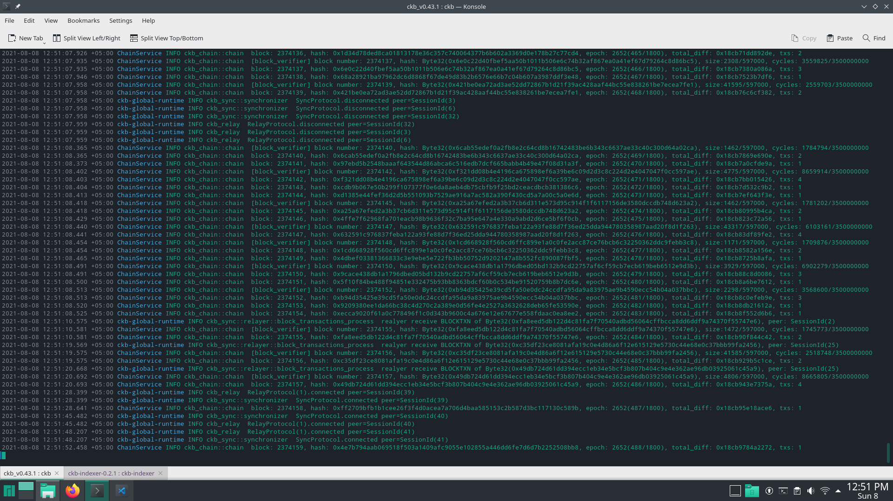
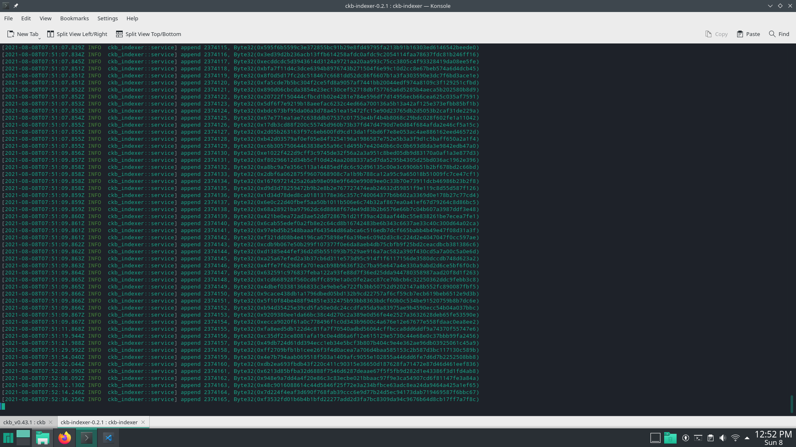

[Gitcoin: 0) Setup a Local CKB Node and CKB Indexer for the Testnet](https://gitcoin.co/issue/nervosnetwork/grants/1/100026176)

local Testnet CKB Node - Fully synchronized - Block Height 2374159

local CKB Indexer - Fully synchronized - Block Height 2374165

