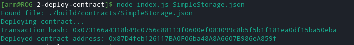

[Gitcoin: 2) Deploy a Simple Ethereum Smart Contract on Polyjuice](https://gitcoin.co/issue/nervosnetwork/grants/3/100026209)

Transaction hash: 0x073166a4318b49c0756c88113f0600ef083099c8b5f5b1f181ea0df15ba50eba
Deployed contract address: 0x87D4feb126117BA0F06ba48A8A6607B986eA859f

