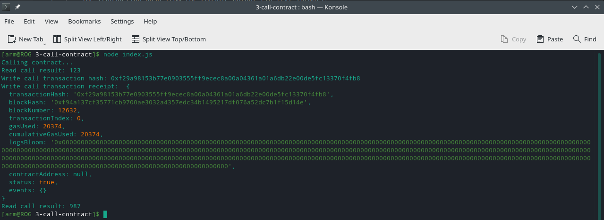

[Gitcoin: 3) Issue a Smart Contract Call to the Deployed Smart Contract](https://gitcoin.co/issue/nervosnetwork/grants/4/100026210)


**Screenshot of the console output of smart contract call**



calls and transaction:
```
get() = 123
set(987)
get() = 987
```

**Transaction hash from the console output**

0xf29a98153b77e0903555ff9ecec8a00a04361a01a6db22e00de5fc13370f4fb8

**Contract address**

0x87D4feb126117BA0F06ba48A8A6607B986eA859f

**ABI for contract**

```
[
    {
      "inputs": [],
      "stateMutability": "payable",
      "type": "constructor"
    },
    {
      "inputs": [
        {
          "internalType": "uint256",
          "name": "x",
          "type": "uint256"
        }
      ],
      "name": "set",
      "outputs": [],
      "stateMutability": "payable",
      "type": "function"
    },
    {
      "inputs": [],
      "name": "get",
      "outputs": [
        {
          "internalType": "uint256",
          "name": "",
          "type": "uint256"
        }
      ],
      "stateMutability": "view",
      "type": "function"
    }
  ]
```

