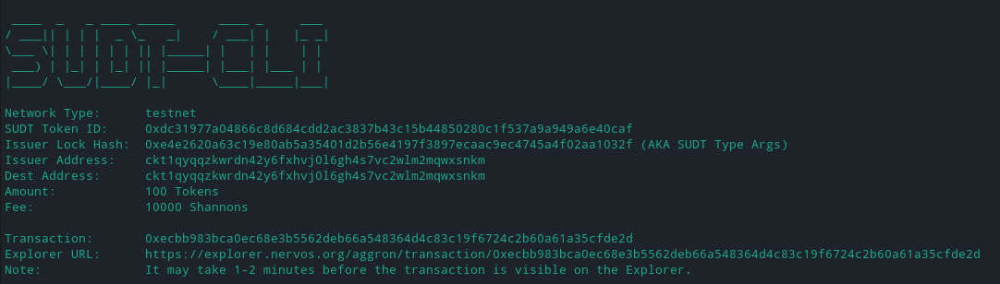
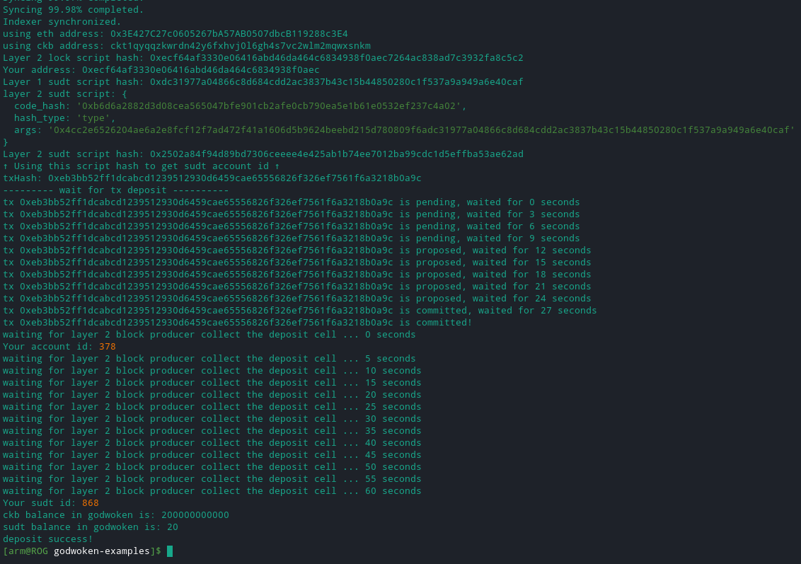

[Gitcoin: 4) Issue an SUDT Token on Layer 1 and Deposit it to Layer 2](https://gitcoin.co/issue/nervosnetwork/grants/5/100026211)

**Layer 1 address's Testnet Explorer link:**
    
https://explorer.nervos.org/aggron/address/ckt1qyqqzkwrdn42y6fxhvj0l6gh4s7vc2wlm2mqwxsnkm

**minted SUDT token:**

**sudt-cli transaction link:**

https://explorer.nervos.org/aggron/transaction/0xecbb983bca0ec68e3b5562deb66a548364d4c83c19f6724c2b60a61a35cfde2d

**SUDT deposit to Layer 2:**

**SUDT ID:**

sudt id: 868
