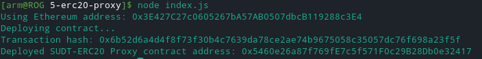
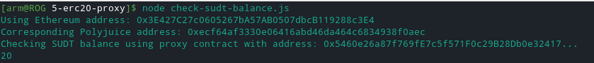

[Gitcoin: 5) Deploy the ERC20 Proxy Contract for the Deposited SUDT](https://gitcoin.co/issue/nervosnetwork/grants/6/100026212)

**Deployed ERC20 Proxy Contract:**

**Contract address:**

Deployed SUDT-ERC20 Proxy contract address: 0x5460e26a87f769fE7c5f571F0c29B28Db0e32417

**SUDT balance:**

**ETH address:**

0x3E427C27c0605267bA57AB0507dbcB119288c3E4
