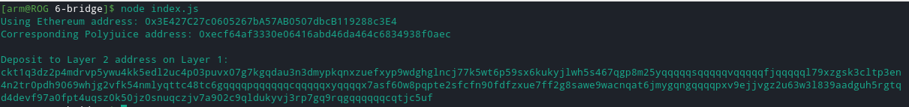

[Gitcoin: 6) Use Force Bridge to Deposit Tokens From Ethereum to Polyjuice](https://gitcoin.co/issue/nervosnetwork/grants/7/100026213)

**Deposit Receiver Address:**

**Deposit Receiver Address (in text format)**

ckt1q3dz2p4mdrvp5ywu4kk5edl2uc4p03puvx07g7kgqdau3n3dmypkqnxzuefxyp9wdghglncj77k5wt6p59sx6kukyjlwh5s467qgp8m25yqqqqqsqqqqqvqqqqqfjqqqqql79xzgsk3cltp3en4n2tr0pdh9069whjg2vfk54nmlyqttc48tc6gqqqqpqqqqqqcqqqqqxyqqqqx7asf60w8pqpte2sfcfn90fdfzxue7ff2g8sawe9wacnqat6jmygqngqqqqpxv9ejjvgz2u63w3l839aadguh5rgtqd4devf97a0fpt4uqsz0k50jz0snuqczjv7a902c9qldukyvj3rp7gq9rqgqqqqqqcqtjc5uf

**Ethereum address:**

0x3E427C27c0605267bA57AB0507dbcB119288c3E4

**Etherscan link of the successful Force Bridge transaction**

https://rinkeby.etherscan.io/tx/0x0c53bce1893b41634068f429828d341bca1ab1dfd7bee878e95e4269c684f491

**Nervos explorer link of the successful Force Bridge transaction**

https://explorer.nervos.org/aggron/transaction/0xd1aed77b5c20762b58190fb5fe1957917d1292c0a542cc14d7c18b2b2d94458e
